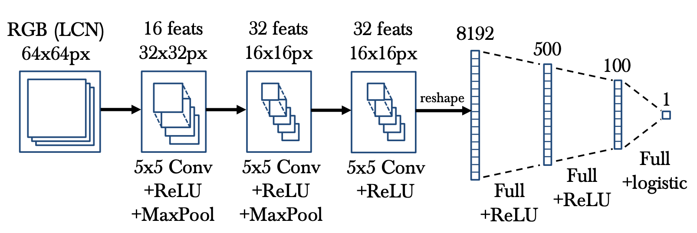

# (Human) Pose Estimation

- most of the time Human Pose Estimation
- many benchmarks are based on images of humans, maybe because of applications where it can be used
- in this article I will only talk about Deep Learning based Pose Estimation models
- nowadays all Pose Estimation Models consist of a DL part (ConvNet)
- first convolutional neural net was applied in 2014 (Jain et al.)
- before ConvNets the best approaches for this task were based on body part detectors (multiple stages of processing)

What is Pose Estimation?
What is the state of the art in the field of pose estimation

- 2D Pose Estimation -> estimate a 2D pose (x,y) coordinates for each joint from a RGB image
- 3D Pose Estimation -> estimate a 3D pose (x,y,z) coordinates 

## Top-down vs. Bottom-up Approaches

Description of the two different approaches
How does pose estimation work?

## Evaluation

Metrics to evaluate Pose estimation models
PCK
AUC

## Datasets/Benchmarks

What are the most popular datasets in this domain

- Frames Labeled in Cinema (FLIC) (https://bensapp.github.io/flic-dataset.html)
- MPII Human Pose Models (http://pose.mpi-inf.mpg.de/)
- COCO
- Leeds Sports Pose Dataset (https://sam.johnson.io/research/lsp.html)

## Important Architectures

Description of a few popular architectures in pose estimation

### Learning Human Pose Estimation Features with Convolutional Networks (2014)

- first deep learning approach to tackle the problem of human pose estimation (conv nets)
- architecture:

- they used multiple convnets to perform independent binary body-part classification
- sliding window approach, output 1 or 0 if body part is in this region
- convnet produces a *response map* indicating the confidence of the body part at that location

- before feeding the image into the network, local contrast normalization is performed

## References

- general information: https://nanonets.com/blog/human-pose-estimation-2d-guide/?utm_source=reddit&utm_medium=social&utm_campaign=pose&utm_content=GROUP_NAME

- cool github with pose estimation papers: https://github.com/cbsudux/awesome-human-pose-estimation

