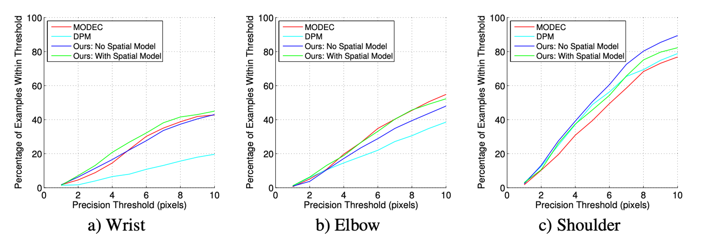
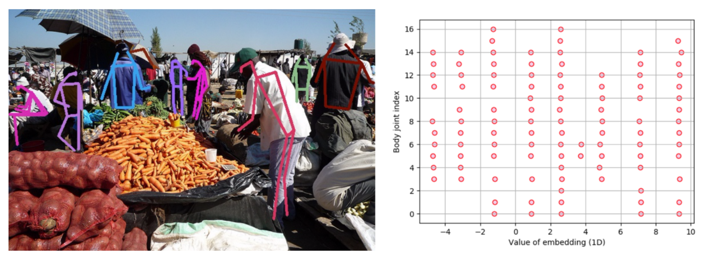
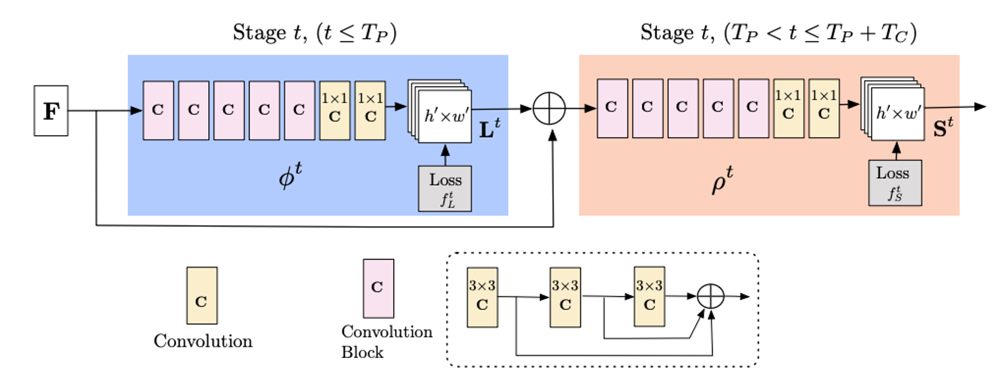
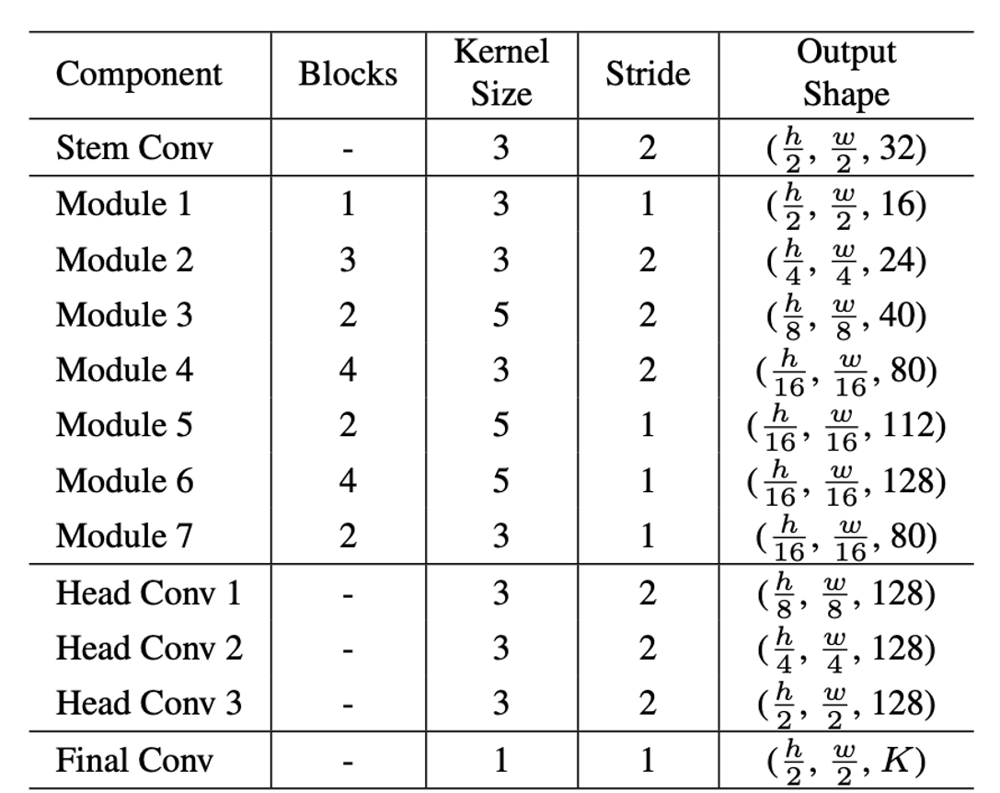

# Introduction

When people in the Machine Learning community talk about Pose Estimation, one can usually assume that they are talking about Human Pose Estimation (HPE). All of the known benchmarks or datasets in the field of pose estimation are based on images of people. Maybe this is due to the many potential applications of such models, e.g. Action/Activity Recognition, movies and animation, Human Computer Interaction, medical assistance, sports motion, self-driving . HPE is a very difficult and challenging problem due to possible strong articulations, small and barely visible joints or keypoints, occlusions, self-similar parts, and a high variance in clothing and lighting. But first of all, what exactly is HPE?

Basically you can differentiate between 2D and 3D pose estimation. In **2D Pose Estimation** a 2D pose of (x,y) coordinates for each joint from a RGB image are estimated. In **3D Pose Estimation** you also incorporate the prediction of a third coordinate z. In this article I will only talk about Deep Learning-based HPE models because nowadays nearly all of these models consist of a Deep Learning part (in most cases Convolutional Neural Networks (CNN)). The first CNN was applied in 2013 by Jain et al. . Before this the best approaches for this task were based on body part detectors (multiple stages of processing). In this blogpost we are going to look closer at the field of deep learning-based 2D HPE (green area in Figure 1) where the basis are exclusively 2D images or videos.

 {: style="width: 100%; max-width: 100%;"} Figure 1. Categorization of HPE methods

Until today a lot has been done in the field of HPE. A wide range of approaches have been researched to make progress in this challenging area. The goal of this blogpost is to give you an overview of the field of HPE, different datasets, evaluation metrics and popular architectures. First of all, there are so many papers and models out there that I cover only a few of them but I try to incorporate the most “popular” ones. For a more scientific view on this I encourage you to check out this recent review here . Since I am a pretty normal human being and far from perfect, there can be mistakes in this blogpost, so if you find one I encourage you to send me an email and then I’ll fix it. Nevertheless, I hope that you like the post and that it is useful for you or exactly what you were looking for.

# Approaches

There are many more possibilities on how to categorize this broad field (e.g. generative vs. discriminative, regression-based vs. detection-based, one-stage vs. multi-stage). In this blogpost I will focus on multi-person HPE because this automatically implies the single-person pose estimation domain (what I mean by this will be clear in a minute). I differentiate between *Top-down* and *Bottom-up* approaches.

**Top-down:** This is a two stage approach where you combine a human detection model (like Faster-RCNN) with a single-person pose estimation model. The detection model first predicts bounding boxes of the people in an image which you feed the pose estimation model which then predicts the keypoint coordinates for the person in the bounding box. This approach depends on the performance of the upstream detection model and can be computationally expensive.

**Bottom-up:** The typical bottom-up HPE framework includes two stages, keypoint detection and grouping. Approaches which work this way and which are part of this blogpost are DeeperCut, OpenPose and Associative Embedding. The challenge with these models lies primarily in the correct grouping or assignment of the keypoints to the corresponding person especially in the case of unnatural poses, distortions or heavy occlusions. Important strengths of these approaches, as opposed to top-down approaches, are scalability and runtime because they don’t rely on the person detector.

# Datasets

Datasets are essential for fair comparison of different algorithms and bring more challenges and complexity through their expansion and improvement in recent years. In this section we present you the most important and popular datasets in the domain of 2D HPE. For a very nice and short overview take a look at Table 7 in .

## Frames Labeled in Cinema (FLIC)

The FLIC dataset contains 5,003 images collected from popular Hollywood movies. For every tenth frame of 30 movies, a person detector was run to obtain about 20,000 person candidates. The groundtruth labels (10 upper body joints) were obtained through the Amazon Mechanical Turk crowdsourcing marketplace (median-of-five labeling). Those labeled images were checked and rejected manually by the authors if the person was occluded or severly non-frontal. The *FLIC-full* dataset is the full set of frames including occluded, non-frontal and plain mislabeled frames. Because many of the training set images contain samples from the test set (1,016 images) scenes which allows unfair overtraining on the FLIC test set Tompson et al. proposed a new dataset called *FLIC-plus* which is a 17380 images subset from the *FLIC-full* dataset without these problems.

## Leeds Sport Pose

The Leeds Sport Pose dataset (LSP) contains 2,000 images of full-body poses collected from Flickr by downloading with 8 sports tags: athletics, badminton, baseball, gymnastics, parkour, soccer, tennis and volleyball. The annotations include up to 14 different visible joints. Figure [fig:lsp] shows a few examples from the original dataset.

 [fig:lsp]

A year later Johnson et al. published the extended version of this dataset containing 10,000 images collected from Flickr searches with the 3 most challenging tags: parkour, gymnastics and athletics. As for FLIC the annotations were generated by the Amazon Mechanical Turk service. The problem with this dataset is that the authors cannot guarantee for the quality of the labels.

## MPII Human Pose Dataset

The Human Pose dataset from the Max Planck Institute for Informatics (MPII) is one of the state-of-the-art benchmarks for HPE with rich annotations. The dataset includes around 25,000 images with more than 40,000 people with 16 annotated joints. Furthermore the dataset covers 410 human activities which is also part of the image annotations. The images were extracted from YoutTube videos. Figure [fig:mpii] shows some random images from the dataset and the associated activites.

 [fig:mpii]

Images in MPII have various body poses and are suitable for many tasks such as 2D single- and multiple HPE, action recognition, etc.

## COCO Keypoints

The Microsoft Common Objects in Context (COCO) dataset is a large-scale dataset that was originally proposed for object detection and segmentation in natural environments. Over time the dataset was improved and extended e.g. with image captions and keypoint labels. The images were collected from Google, Bing and Flickr image search with isolated as well as pairwise object categories. The annotations were also conducted on Amazon Mechanical Turk.

 [fig:coco]

The whole dataset contains more than 200,000 images and 250,000 labeled person instances. Annotations on train and validation sets with over 150,000 people and 1.7 million labeled keypoints are publicly available. The annotations for each person include 17 body joints with visibility and left/right labels, and instance human body segmentation. Moreover the COCO dataset contains about 120,000 unlabeled images following the same class distribution as the labeled images which can be used for unsupervised or semi-supervised learning.

## AIC-HKD Dataset

The AI Challenger Human Keypoint Dataset (AIC-HKD) is a subset of the large-scale dataset called AI Challenger. It is the biggest benchmark dataset out there containing 210,000 images for training, 30,000 for validation and 60,000 for testing. For the 210 000 images in training set, there are 378,374 human figures with almost 5 million keypoints. Among all the human keypoints 78.4% of them are labeled as visible(v = 1) and the rest of them are labeled as not visible(v = 2). All of these images were collected from Internet search engines. Inappropriate images (e.g. politicians, sexual contents) were removed manually. In addition, images with too many human figures (e.g. crowds in a soccer stadium) and those with very small human figures were excluded. The skeleton consists of 14 different human skeletal keypoints with one of three possible visibility flags: labeled and visible, labeled but not visible or not labeled.
In addition to the presented 2D image datasets there exist video-based datasets for the same purpose e.g. the Penn Action Dataset , the Joint-annotated Human Motion Database (J-HMDB) , PoseTrack . You can also check them out if you are interested in this.

# Evaluation

Because of the fact that different datasets have different features, e.g. various range of human body sizes, full or only upper human body, in combination with different task requirements (single- or multi-person) there exist several evaluation metrics for 2D HPE. In the following I will describe the most common evaluation metrics in HPE which are regularly used to compare different approaches

## Percentage of Correct Parts

Percentage of Correct Parts (PCP) is widely used in early research as evaluation metric. A limb is considered detected if the distance between the two predicted joint locations and the true limb joint locations is less than 50% of the limb length (commonly denoted as PCP@0.5). The smaller the PCP value, the better the performance of the model. The drawback of this metric is that it penalizes shorter limbs because shorter limbs like lower arms which are usually harder to detect. Moreover there exist a few slightly modified versions of this metric.

## Percentage of Correct Keypoints

The Percentage of Correct Keypoints (PCK) measures the accuracy of the localization of body joints where a candidate joint is considered as correct if it is within a certain distance or threshold of the groundtruth joint. The threshold can e.g. be a fraction of the person bounding box or 50% of the head bone link, which is denoted as PCKh@0.5 . This alleviates the problem with shorter limbs mentioned before and is e.g. the standard evaluation metric for MPII evaluation. Another possibility is to use a pixel radius normalized by the torso height of each test sample as threshold value , which is also denoted as Percentage of Detected Joints (PDJ) by .

## Average Precision & Recall

Imagine you have a dataset with groundtruth labels for different keypoints but without the bounding boxes. How do you evaluate your approach on such a dataset? You can use Average Presicion (AP) similar to object detection. If a predicted joint falls within a threshold of the groundtruth joint location, it is counted as true positive. For MPPE evaluation, all predicted poses are assigned to the groundtruth poses one by one based on the PCKh score order while unassigned predictions are counted as false positives. The mean AP (mAP) is reported from the AP of each body joint. For the COCO dataset AP, AR and their variants are reported based on the object keypoint similarity (OKS, more on this down below) which plays a similar role as the Intersection over Union (IoU).

## Object Keypoint Similarity

The Object Keypoint Similarity evaluation metric (OKS) is used for the Keypoint Evaluation in the COCO benchmark. For each object in this dataset the ground truth keypoints have the form \([x_{1}, y_{1}, v_{1}, ..., x_{k}, y_{k}, v_{k}]\) where \(x\) and \(y\) are the keypoint locations and \(v\) is a visibility flag (0 : not labeled; 1 : labeled but not visible; 2 : labeled and visible). On top of that each ground truth label has a scale \(s\) which is defined as the square root of the object segment area.

The OKS is defined as followed:

\[OKS = \frac{\sum_{i} exp(-d_{i}^{2} / 2s^{2}k_{i}^{2}) \delta (v_{i} > 0)}{\sum_{i} \delta (v_{i} > 0)}\]

Here \(d_{i}\) also describes the euclidean distance between the ground truth keypoint and the detection and \(k_{i}\) is a per-keypoint constant that controls falloff.

## Computational Performance

The computational performance metrics are also very important in the field of HPE. The *Frame Rate* indicates the processing speed of input data, generally expressed by Frames per Second (FPS) or seconds per image (s/image). This is an important metrics e.g. for real-world applications which require real-time-estimation. The *Number of Weights/Parameters* and the *GFLOPs* (Giga Floating-point Operations per second) are two key performance indicators often mentioned. They show the efficiency of the network and the specific use of GPUs or CPUs.

# Popular architectures

In the following I will describe a few popular architectures in Single- and Multi-Human Pose Estimation but there are much more out there.

## Learning Human Pose Estimation Features with Convolutional Networks (2013)

This paper describes the first deep learning approach to tackle the problem of single-person full body human pose estimation with convolutional neural networks. In this approach the authors trained multiple independent binary classification networks, one network per keypoint. The model is applied in a sliding window approach and outputs a response map indicating the confidence of the body part at that location. The figure [fig:conv1] below shows the architecture of the classification models.

 [fig:conv1]

The input is of shape 64x64 pixel and locally contrast normalized (LCN). As activation functions ReLU is used. To reduce computational complexity max pooling is applied twice which leeds to some spatial information loss. After the three convoliutional layers follow three fully connected layers. To reduce overfitting, L2 regularization and dropout are applied in the fully connected layers. The output layer is a single logistic unit, representing the probability of a body part being in the patch. Moreover the authors use part priors for the final prediction. For a detailed breakdown of how all this works you should have a look at the paper. The model was evaluated on the FLIC dataset based on the PCK metric described before . Figure [fig:conv2] shows the performance on the wrist, elbow and shoulder joints of 351 FLIC test set images.

 [fig:conv2]

## Convolutional Pose Machines (2016)

A Convolutional Pose Machine is a single-person Human Pose Estimation model which incorporates convolutional networks into the pose machine framework from Ramakrishna et al. () and inherits its benefits like the implicit learning of long-range spatial dependencies and a modular sequential design. This results in a differentiable architecture that allows for end-to-end training with backpropagation on large amounts of data. Figure [fig:cpm1] shows the overall architecture of the model.

 [fig:cpm1]

It consists of a sequence of stages (ConvNets) which produce 2D belief maps (heatmaps) for each part/keypoint. Before the images are fed into the network they are scaled down to a size of 368x368 pixels. The first stage consists of seven convolutional and three pooling layers with different kernel sizes. The second and all following stages are different from the first one. Here you use the first layers (share weights) of stage one to produce a belief map which is then concatenatet to the output map of the previous stage. After that you feed the concatenated maps into five more convolutional layers. Every stage outputs P+1 belief maps of 46x46 pixels where P is the number of parts and the additional belief map is for the background. At every stage of the model a loss (MSE) is computed based on these belief maps and divided by the number of pixel values (46x46x15). This also addresses the problem of vanishing gradients. In the end, these individual losses are added together to form an overall loss. At every stage the prediction quality is refined as you can see in Figure [fig:cpm2].

 [fig:cpm2]

In the first and second stage the model isn’t sure which of the two wrists is the right one but in the third stage it seems to be certain. The same goes for the elbows. The model is evaluated on the MPII, FLIC and the Leeds Sports Pose datasets (for detailed information on the performance on all of these, take a look at the original paper). Figure [fig:cpm3] shows the results on MPII in comparison to other state-of-the-art models at that time. The evaluation is based on PCKh metric.

 [fig:cpm3]

## Deep(er)Cut (2016)

DeeperCut is an improved version of the DeepCut model which is a multi-person pose estimation approach based on integer-linear programming (ILP) that jointly estimates poses of all people present in an image by minimizing a joint objective. One of the differences between Deep and DeeperCut is that they replace the VGG backbone from the part detector with a modified ResNet-152 for computing part probability scoremaps. This also increases the size of the receptive field from 400 to 1000px which allows a better incorporation of context in the predictions. In addition location refinement is performed by predicting offsets from the locations on the scoremap grid to the ground truth joint locations. During training sigmoid activations and cross entropy loss function are applied.

The large receptive field contains enough information to reason about locations of other parts/joints in the vicinity which is why the authors also use deep networks to make pairwise part-to-part predictions. Those are subsequently used to compute pairwise probabilities. For detailed information on the computations and the incorporation of these pairwise probabilities I encourage you to take a look at both original papers. For me personally it was pretty hard to follow their thinking and their calculations. Maybe it helps to inspect their implementation on github to deeply understand this. Moreover I don’t know anything about ILP.

The two main problems of the DeepCut ILP approach are long computation times for solving the optimization problem and the fact that no distinction is made between reliable and less-reliable detections. Therefore in DeeperCut not one but several instances of ILP’s are solved based on the reliabilities of the part detections. Figure [fig:deepercut] displays the results on the MPII validation set.

 [fig:deepercut]

## Stacked Hourglass Networks (2016)

The Stacked Hourglass model is an approach for single-person pose estimation based on repeated bottom-up, top-down processing used in conjunction with intermediate supervision. Its name originates from its modular design and symmetric topology which you can see in Figure [fig:hourglass1]. One important operational difference between this approach and related work is that they don’t use unpooling or deconvolutional layers instead nearest neighbour upsampling and skip connections for top-down processing are incorporated. But why to use this form of network design?

 [fig:hourglass1]

This is because of the need to capture information at every scale. A final pose estimate requires a coherent understanding of the full body. The hourglass is a simple minimal design that has the capacity to capture important features like e.g. the persons orientation, the arrangement of their limbs and the relationship of adjacent joints. Figure [fig:hourglass2] shows one hourglass module which consists of multiple convolutional and max pooling layers used to process features down to a very low resolution. At each max pooling step the network branches off and applies more convolutions at the original pre-pooled resolution. The network reaches its lowest resolution at 4x4 pixels and starts the top-down process of nearest neighbor upsampling followed by elementwise addition operations. After the last hourglass module, two consecutive 1x1 convolutional layers are added to produce the final network predictions which is a set of heatmaps containing the probability of a joints presence at each and every pixel.

 [fig:hourglass2]

The highest hourglass output resolution is 64x64 due to memory limits. As mentioned in the beginning intermediate supervision is essential for the approach which is realized by the prediction of intermediate heatmaps (between HG modules) upon which a loss can be applied. The final design consists of eight consecutive hourglass modules and a MSE loss is applied to the predictions of all modules using the same ground truth heatmap, consisting of a 2D gaussian with standard deviation of 1px centered on the joint location (similar to the Convolutional Pose Machines approach). The evaluation is carried out on the FLIC and MPII datasets using PCK normalized by torso size for FLIC and head size (PCKh) for MPII. Figure [fig:hourglass3] shows the results on MPII. The model has mostly problems with images containing multiple people and occluded joints.

 [fig:hourglass3]

## PRM (2017)

The proposed model is based on the Stacked Hourglass architecture incorporating so called Pyramid Residual Modules (PRM) and a new initialization scheme for multi-branch networks . The goal of the introduction of PRMs is to enhance the robustness of DCNNs against scale variations of visual patterns by learning multi-scale features. Many of the popular CNN architectures are multi-branch networks, e.g. Inception, ResNets, Convolutional Pose Machines, Stacked Hourglass Network for which the existing weight initialization schemes aren’t proper. Therefore the authors propose a new method to initialize multi-branch layers that takes the number of branches into consideration. In this article we will focus on the PRMs so for detailed information on the initialization problem please take a look at the original paper.

 [fig:prm1]

The approach presented in this paper is based on the Stacked Hourglass Network which is adopted and the residual units are replaced by PRMs. Figure [fig:prm1] gives a nice overview of the proposed new framework. As you can see the input image is 256x256px cropped from a resized image according to the annotated body position and scale. Instead of max or average pooling, fractional max pooling is used to obtain input feature maps of different resolutions.
Now lets take a closer look at the proposed PRM and its inner workings. I am more of a visual guy and the provided overview of the different PRM versions helped me understand them better. Mathematically the PRM can be formulated as

\[\mathbf{x}^{(l+1)} = \mathbf{x}^{(l)} + \mathcal{P}(\mathbf{x}^{(l)}, \mathbf{W}^{(l)})\]

where \(\mathcal{P}(\mathbf{x}^{(l)}; \mathbf{W}^{(l)})\) is Feature Pyramids decomposed as

\[\mathcal{P}(\mathbf{x}^{(l)}, \mathbf{W}^{(l)}) = g(\displaystyle\sum_{c=1}^{C} f_{c}(\mathbf{x}^{(l)}; \mathbf{w}^{(l)}_{f_{c}}); \mathbf{w}^{(l)}_{g}) + f_{0}(\mathbf{x}^{(l)}; \mathbf{w}^{(l)}_{f_{0}})\]

Here \(\mathbf{x}^{(l)}\) and \(\mathbf{W}^{(l)}\) are the input and the filter of the \(l\)-th layer respectively. The \(C\) denotes the number of pyramid levels and \(\mathbf{W}^{(l)} = \{\mathbf{w}_{f_{c}}^{(l)}, \mathbf{w}_{g}^{(l)}\}_{c=0}^{C}\) is the set of parameters. To reduce computational and space complexity each \(f_{c}(\cdot)\) is designed as a bottleneck structure. As you can see in the Figure [fig:prm2] the authors experimented with four slightly different PRM architectures which all performed better than the baseline in terms of accuracy, number of parameters and complexity. Between the four new modules PRM-B showed the best balance in terms of accuracy and complexity. The number of pyramid levels \(C\) was varied between 3 and 5. The authors observed that increasing \(C\) generally improves the performance.

 [fig:prm2]

Important to mention is that the PRM is a general module (not only suitable for HPE) that can be used as the basic building block for various other CNN architectures e.g. in image classification networks. Regarding the training procedure and inference the proposed approach is pretty similar to common HPE approaches, as score maps (heatmaps) generated from a Gaussian represent the body joint locations. A loss is attached at the end of each stack defined by the squared error. The approach was tested on MPII and LSP. The authors used PCK@0.2 for LSP evaluation and PCKh@0.5 for MPII. Figure [fig:prm3] displays the evaluation results.

 [fig:prm3]

The input images are 256x256 cropped from a resized image according to the annotated body position and scale. The training data is augmented by scaling, rotation, flipping and adding color and noise. In comparison to the baseline hourglass model the complexity is increased by 13.5% (from 23.7M to 26.9M parameters) and the number of GFLOPs (45.9) for a 256x256 image is also increased by 11.4%.

## Associative Embedding (2017)

The problem of bottom-up MPPE can be broken down into detection and grouping: detecting body joints and grouping them into individual people. Associative Embedding is a single-stage method to tackle this task end-to-end by grouping detections through a process called “tagging”. A tag (real number) associates a detection with other detections of a specific group.

 [fig:asso1]

Figure [fig:asso1] gives an overview of the approach. Here a stacked hourglass network is used to predict a detection score at each pixel location for each body joint, regardless of person identity. In addition the network automatically groups detections into individual poses. For each joint heatmap a corresponding “tag” heatmap is produced (2m output channels for \(m\) body joints). NMS is used to parse detection into individual people by retrieving their corresponding tags at those pixel locations. Then detections are grouped across body parts by comparing the tag values of detections and matching up those which are close enough. Such a group forms then the human pose estimate. The authors use a combination of a detection loss and a grouping loss on the output heatmaps for training the network. The detection loss computes the MSE between the predicted and the groundtruth heatmaps, as we have seen in approaches before. The grouping loss assess how well the predicted tags agree with the groundtruth grouping. Therefore for each person a reference embedding gets produced instead of enforcing the loss across all possible pairs of keypoints. Within an individual, the squared distance between the reference embedding and the predicted embedding for each joint are calculated. Then between pairs of people, their reference embeddings are compared to each other with a penalty that drops exponentially to zero as the distance between two tags increases. Formally this looks the following way. Let \(h_{k} \in \mathbb{R}^{W \times H}\) be the predicted tagging heatmap for the \(k\)-th body joint, where \(h(x)\) is a tag value at pixel location \(x\). Given \(N\) people, let the groundtruth joint locations be \(T=\{(n_{nk})\}\), \(n=1,...,N\), \(k=1,...,K\), where \(n_{nk}\) is the groundtruth pixel location of the \(k\)-th joint of the \(n\)-th person. The reference embedding for the \(k\)-th person would be:

\[\bar{a}_{n} = \frac{1}{K} \displaystyle \sum_{k} h_{k} (n_{nk})\]

The grouping loss can then be defined as

\[L_{g}(h, T) = \frac{1}{N} \displaystyle \sum_{n} \displaystyle \sum_{k} (\bar{h}_{n} - h_{k}(x_{nk}))^{2} \\
+ \frac{1}{N^{2}} \displaystyle \sum_{n} \displaystyle \sum_{\bar{n}} \exp \{ - \frac{1}{2 \sigma^{2}} (\bar{h}_{n} - \bar{h}_{\bar{n}})^{2} \}\]

Figure [fig:asso2] shows an example of the tags produced by the network. In this case the tags are well separated (1D embedding) and the decoding process into groups is straightforward. A final set of predictions is produced by iterating over each joint, starting from the head and taking all activations above a certain threshold after NMS, which from the basis of an initial pool of people. Step by step the other detections are matched and assigned to a person. Important to note here is that no steps are taken to ensure anatomical correctness or reasonable spatial relationships between pairs of joints.

 [fig:asso2]

The architecture was evaluated on MPII multi-person and COCO (results in Figure [fig:asso3]). The network used here consists of four stacked hourglass modules with an input size of 512x512 and an output resolution of 128x128. The model outperforms the state-of-the-art models at that time in most of the COCO test-dev metrics.

 [fig:asso3]

## RMPE (2017)

The Regional-Multi-Person Pose Estimation (RMPE) framework imroves the performance of single-person pose estimation (SPPE) based HPE algorithms and therefore addresses two major problems of top-down HPE approaches: the localization error and redundant detections.

 [fig:rmpe1]

It consists of three components which are shown in Figure [fig:rmpe1]: a Symmetric Spatial Transformer Network (SSTN), parametric Pose NMS and a Pose Guided Proposals Generator (PGPG). The bounding box proposals are obtained by an object detection model and fed into the SSTN+SPPE module which generates pose proposals. The SSTN extracts a high-quality single person region from an inaccurate bounding box. Figure [fig:rmpe2] gives a detailed overview of the SSTN+SPPE module itself including the parallel SPPE for training. On the right side of the image you see an example from the original spatial transformer paper which illustrates pretty well what it does (in my opinion) with a few different examples from MNIST. The first of the three images is the input image, the second one illustrates the the result of the localisation network which predicts a transformation to apply to the input image. The third one displays the result.

 [fig:rmpe2]

The Spatial De-Transformer Network (SDTN) is required for remapping the resulting pose estimation to the original human proposal coordinates (SDTN is an inverse procedure of STN). During training an additional parallel SPPE branch is added to improve the STN extraction quality. This branch omits the SDTN and its output is directly compared to labels of center-located groundtruth poses. The weights of this branch are fixed and is is used to backpropagate pose errors to the STN module. For more detailed information on the STN model I recommend to take a look at the original paper .

The generated pose proposals are refined by parametric Pose NMS (eliminate redundancies). This process works in the following way: first the most confident pose is selected as reference and some poses close to it are subject to elimination by applying an elimination criterion (repeat until redundant poses are eliminated) which can be mathematically expressed as follows:

\[f(P_{i}, P_{j}\mid\Lambda,\eta) = 1[d(P_{i},P_{j}\mid\Lambda,\lambda) \leq \eta]\]

\(P_{i}\) and \(P_{j}\) are poses with \(m\) joints, denoted as \(\{\langle k_{i}^{1}, c_{i}^{1} \rangle, ... ,\langle k_{i}^{m}, c_{i}^{m} \rangle\}\) where \(k_{i}^{j}\) and \(c_{i}^{j}\) are the \(j^{th}\) joint location and cofidence score. \(d(P_{i}, P_{j}\mid\Lambda)\) is a pose distance metric with a parameter set of \(\Lambda\) and a threshold \(\eta\) as elimination criterion. The distance function consists of two components and can be written as

\[d(P_{i}, P_{j}\mid\Lambda) = K_{sim}(P_{i}, P_{j}\mid\sigma_{1}) + \lambda H_{sim}(P_{i}, P_{j}\mid\sigma_{2})\]

where \(\lambda\) is a weight balancing the two distances and \(\Lambda=\{\sigma_{1},\sigma_{2},\lambda\}\). For more details on the two components \(K_{sim}\) and \(H_{sim}\) you should take a look at the original paper. The parameters described can be determined in a data driven manner.
For better adaptation to imperfect human proposals the authors created a Pose-Guided Proposal Generator which generates a large sample of additional augmented training proposals with the same distribution as the output of the human detector. The distribution of the relative offset between the detected bounding boxes and the groundtruth boxes varies across different poses, so there exists a distribution \(P(\delta B\mid atom(P))\) where \(\delta B\) is the offsets and \(atom(P)\) denotes the atomic pose (determined through k-mean clustering) of \(P\). During training for each annotated pose in the training sample, first the atomic pose is looked up and then additional offsets are generated by dense sampling according to \(P(\delta B \mid a)\) to produce augmented training proposals.

The new framework was tested on MPII multi-person and MSCOCO keypoints 2016. The authors used the VGG-based SSD-512 model as human detector. In order to guarantee that the entire person region will be extracted, detected human proposals are extended by 30% along both the height and the width. As SPPE the stacked hourglass model, presented before, was incorporated. For the STN network the authors adopted a ResNet-18 as localization network and they used a smaller 4-stack hourglass network as the parallel SPPE.

 [fig:rmpe3]

In Figure [fig:rmpe3] you can see the results on both benchmarks. On MPII it is most notable that the framework increases the mAP on difficult joints like wrists, elbows, ankles and knees significantly. On MSCOCO the framework performs as good as CMU-Pose (bottom-up approach) and much better than other approaches the authors looked at. In their ablation studies they evaluated the effectiveness of all three proposed components.

## Cascaded Pyramid Network (2018)

The Cascaded Pyramid Network (CPN) is a network structure which targets to relieve the problem of pose estimation from especially hard-to-predict keypoints which include occluded and invisible ones as well as complex backgrounds and crowded scenes. The authors name two reasons for the difficulty. First the “harder” to detect joints cannot be simply recognized based on their appearance features only (e.g. the torso point). Second they are not explicitly addressed during the training process. Therefore this new algorithm includes two stages: GlobalNet and RefineNet (Figure [fig:cpn1]).

 [fig:cpn1]

It is a top-down approach incorporating a Feature Pyramid Network (FPN) as human detection model. The ROIPooling in FPN is replaced with ROIAlign from Mask-RCNN and trained on all COCO categories first. The GlobalNet structure is based on the ResNet backbone. 3x3 convolutional filters are applied on the feature maps outputted by the residual blocks 2 to 5 to generate heatmaps for keypoints. The basic idea is the same as in FPN, that the shallower feature maps contain the high spatial resolution for localization but low semantic information for recognition. On the other hand the feature maps produced by deeper layers have more semantic and less spatial resolution. Figure [fig:cpn2] shows the output heatmaps of both the GlobalNet and RefineNet.

 [fig:cpn2]

As you can see GlobalNet is able to effectively locate the “easier” keypoints like eyes but struggles with the “harder” ones. To improve the performance on harder keypoints RefineNet is attached to GlobalNet. It transmits the information across different levels and integrates them via upsampling and concatenation. The hard keypoints are explicitly selected based on the training loss (called *online hard keypoints mining*) and their gradients are backpropagated. Figure [fig:cpn3] shows the results of the proposed approach on the COCO test-dev dataset where the “+” sign indicates results using ensembled models. Each human detection box is extended to a fixed aspect ratio, e.g. height : width = 256 : 192 and then cropped from the image without distorting the images aspect ratio. Moreover data augmentation is important for the learning of scale- and rotation-invariance. After the cropping, random flipping, random rotation (\(-45^\circ \sim +45^\circ\)) and random scaling (\(0.7 \sim 1.35\)) are applied. For more detailed information about the training procedure, ablation studies and the results you should take a look at the original paper.

 [fig:cpn3]

## OpenPose (2019)

OpenPose is the first open-source realtime system for bottom-up multi-person 2D pose estimation and it’s one of the most popular frameworks out there (OpenCV included it). One of the main problems of top-down approaches in HPE is their early commitment, which means that if the person detector fails (this is often the case when people are in close proximity) there is no recourse to recovery. Another problem is the computational complexity and the runtime which is proportional to the number of people in the image. OpenPose works bottom-up, like DeeperCut, but much much faster. Figure [fig:openpose1] illustrates the whole pipeline of this approach.

 [fig:openpose1]

It takes as input an image of size \(w \times h\) and produces the 2D locations of anatomical keypoints for each human in the image. In the first step, a convolutional neural network predicts a set of 2D confidence maps (heatmaps) \(\mathbf{S}\) of body part locations (Figure [fig:openpose1] (b)) and a set of 2D vector fields \(\mathbf{L}\) called part affinity fields (PAFs). These encode the degree of association between parts (Figure [fig:openpose1] (c)). The set \(\mathbf{S}=(\mathbf{S}_{1}, \mathbf{S}_{2}, ..., \mathbf{S}_{J})\) has \(J\) confidence maps., one per part, where \(\mathbf{S}_{J} \in \mathbb{R}^{w \times h}\) , \(j \in \{1,...,J\}\). The set \(\mathbf{L}=(\mathbf{L}_{1}, \mathbf{L}_{2}, ..., \mathbf{L}_{C})\) has \(C\) vector fields, one per limb, where \(\mathbf{L}_{c} \in \mathbb{R}^{w \times h \times 2}\) , \(c \in \{1,...,C\}\). In this context limbs are part pairs. Then a parsing step creates a set of bipartite matchings to associate the body part candidates. Finally the candidates are assembled into full body poses. Figure [fig:openpose2] shows the architecture of the model, which iteratively predicts affinity fields (blue) and detection confidence maps (beige). The predictions are refined over the successive stages \(t \in \{1,...,T\}\) including intermediate supervision at each stage similar to the Convolutional Pose Machines approach.

 [fig:openpose2]

Before the image is fed to the first stage it gets transformed in a set of feature maps \(\mathbf{F}\) by the first 10 layers of a pretrained and finetuned VGG19 network. Based on these maps the first stage produces a set of PAFs \(\mathbf{L}_{1} = \phi^{1}(\mathbf{F})\) where \(\phi^{1}\) refers to the operations in stage 1. In each subsequent stage the predictions from the previous stage and the original image features \(\mathbf{F}\) are concatenated and used to produce refined predictions,

\[\mathbf{L}^{t}=\phi^{t}(\mathbf{F}, \mathbf{L}^{t-1}), \forall 2 \leq t \leq T_{p},\]

where \(t\) denotes the stage and \(T_{p}\) refers to the total number of PAF stages. After \(T_{p}\) iterations the process is repeated for the confidence maps detection,

\[\mathbf{S}^{T_{p}}=p^{t}(\mathbf{F},\mathbf{L}^{T_{p}}), \forall t = T_{p}\] \[\mathbf{S}^{t}=p^{t}(\mathbf{F},\mathbf{L}^{T_{p}}, \mathbf{S}^{t-1}), \forall T_{p} < t \leq T_{p} + T_{c}\]

where \(p_{t}\) refers to the CNNs for inference at stage \(t\) and \(T_{c}\) to the number of total confidence map stages. At the end of each stage a \(L_{2}\) loss between the estimated predictions and the groundtruth maps and fields is applied. The loss functions are:

\[f_{\mathbf{L}}^{t_{i}} = \displaystyle\sum_{c=1}^{C} \displaystyle\sum_{\mathbf{p}} \mathbf{W}(\mathbf{p}) \cdot \| \mathbf{L}_{c}^{t_{i}}(\mathbf{p}) - \mathbf{L}_{c}^{*}(\mathbf{p}) \|_{2}^{2}\] \[f_{\mathbf{S}}^{t_{k}} = \displaystyle\sum_{j=1}^{J} \displaystyle\sum_{\mathbf{p}} \mathbf{W}(\mathbf{p}) \cdot \| \mathbf{S}_{j}^{t_{k}}(\mathbf{p}) - \mathbf{S}_{j}^{*}(\mathbf{p}) \|_{2}^{2}\]

where \(\mathbf{L}_{c}^{*}\) is the groundtruth PAF, \(\mathbf{S}_{j}^{*}\) is the groundtruth part confidence map and \(\mathbf{W}\) is a binary mask with \(\mathbf{W}(\mathbf{p})=0\) when the annotation of a person or part is missing at the pixel \(\mathbf{p}\) (in many datasets not all humans in an image are labelled). The overall objective is:

\[f=\displaystyle \sum_{t=1}^{T_{p}} f_{\mathbf{L}}^{t} + \displaystyle \sum_{t = T_{p} + 1}^{T_{p} + T_{c}} f_{\mathbf{S}}^{t}\]

Now lets take a closer look on how the confidence maps and the PAFs are generated. The confidence maps \(\mathbf{S}_{j,k}^{*}\) for each person \(k\) and the joint \(j\) are defined as

\[\mathbf{S}_{j,k}^{*}(\mathbf{p})=\exp(- \frac{\| \mathbf{p} - \mathbf{x}_{j,k} \|_{2}^{2}}{\sigma^{2}}),\]

where \(x_{j,k}\) is the location of the body part and \(\sigma\) controls the spread of the peak. At test time the predicted body part candidates are obtained by performing NMS.
Now lets get to the PAFs. Each of them is a 2D vector field for each limb. For every pixel in the area belonging to a particular limb, a 2D vector encodes the direction that points from one part of the limb to the other. Let \(x_{j_{1},k}\) and \(x_{j_{2},k}\) be the groundtruth positions of body parts \(j_{1}\) and \(j_{2}\) from the limb \(c\) for person \(k\) in the image. If a point \(\mathbf{p}\) lies on the limb, the value at \(\mathbf{L}_{c,k}^{*}(\mathbf{p})\) is a unit vector that points from \(j_{1}\) to \(j_{2}\). For all other points the vector is zero valued. The groundtruth PAF \(\mathbf{L}_{c,k}^{*}\) at point \(\mathbf{p}\) is defined as

\[\mathbf{L}^{*}_{c,k} (\mathbf{p}) = 
\begin{cases}
    \mathbf{v}      & \quad \text{if } p \text{ on limb } c, k\\
    0  & \quad \text{otherwise}
\end{cases}\]

where \(\mathbf{v} = (x_{j_{2},k} - x_{j_{1},k}) / \| x_{j_{2},k} - x_{j_{1},k} \|_{2}\) is the unit vector in the direction of the limb. So now, how do you define the set of points which lie on the limb? This is accomplished by a distance threshold of the line segment, e.g. those points \(\mathbf{p}\) for which

\[0 \leq \mathbf{v} \cdot (\mathbf{p} - x_{j_{1},k}) \leq l_{c,k} \text{and} | \mathbf{v}_{\bot} \cdot (\mathbf{p} - x_{j_{1},k}) | \leq \sigma_{l},\]

where the limb width \(\sigma_{l}\) is a distance in pixel, \(l_{c,k} =  \| x_{j_{2},k} - x_{j_{1},k} \|_{2}\) is the limb length and \(\mathbf{v}_{\bot}\) is a vector perpendicular to \(\mathbf{v}\). The groundtruth PAF averages the affinity fields of all people in the image,

\[\mathbf{L}^{*}(\mathbf{p}) = \frac{1}{n_{c}(\mathbf{p})} \displaystyle \sum_{k} \mathbf{L}_{c,k}^{*} (\mathbf{p})\]

where \(n_c(\mathbf{p})\) is the number of non-zero vectors at point \(\mathbf{p}\) across all people. The association between part candidates is measured by computing the line integral over the corresponding PAF along the line segment connecting the candidate part locations. This measures the aligment of the predicted PAF with the candidate limb that would be formed. For two candidate part locations \(\mathbf{d}_{j_{1}}\) and \(\mathbf{d}_{j_{2}}\), the predicted PAF \(L_{c}\) gets sampled along the line segment to measure the confidence in their association:

\[E= \int_{u=0}^{u=1} \mathbf{L}_{c}(\mathbf{p}(u)) \cdot \frac{\mathbf{d}_{j_{2}} - \mathbf{d}_{j_{1}}}{ \| \mathbf{d}_{j_{2}} - \mathbf{d}_{j_{1}} \|_{2}} du,\]

where \(p(u)\) interpolates the position of the two body parts \(\mathbf{d}_{j_{1}}\) and \(\mathbf{d}_{j_{2}}\),

\[\mathbf{p}(u) = (1-u) \mathbf{d}_{j_{1}} + u \mathbf{d}_{j_{2}}\]

To obtain a discrete set of part candidate locations NMS on the confidence maps is performed, which form a large set of possible limbs. Each limb candidate is scored by the line integral described before. The resulting \(K-dim\) matching problem is known to be NP-hard but in the special case of HPE two relaxations can be added. First, instead of the whole graph a minimal number of edges to obtain a spanning tree skeleton can be chosen. Second, the matching problem can be decomposed into a set of bipartite matching subproblems. The authors demonstrate that a minimal greedy inference well-approximates the global solution at a fraction of the computational cost.

 [fig:openpose3]

The method is evaluated on three MPPE datasets: MPII multi-person, COCO and a self created foot dataset. Figure [fig:openpose3] shows the results on the COCO test-dev set based on the OKS evaluation metric. One of the main strengths of this approach, in comparison to top-down approaches, is its inference runtime which is independent from the number of people per image. Figure [fig:openpose4] illustrates its superior performance in this regard. This realtime capability is also very important for many real-world applications and one of the reasons why this approach is very well known.

 [fig:openpose4]

## HRNet (2019)

In the authors present a novel model architecture for SPPE, called *High-Resolution Net* (HRNet) which is able to maintain high-resolution representations through the estimation process. Figure [fig:hrnet1] illustrates the architecture of this approach. It consists of parallel high-to-low resolution subnetworks starting from a high-resolution subnetwork. Gradually high-to-low resolution subnetworks are added to form more stages. These multi-resolution subnetworks are connected in parallel. Multi-scale fusions processes are carried out to enable the information exchange across these parallel subnetworks.

 [fig:hrnet1]

The two main benefits of this approach in comparison to existing methods are a higher spatial precision due to the maintenance of high resolution (instead of recovering of high from low resolution) and the parallelization instead of serialization. Moreover the network outputs more accurate heatmaps because of the repeated multi-scale fusions. Now lets take a closer look at the details.
The goal is to detect the locations of \(K\) keypoints in an image \(\mathbf{I}\) of size \(W \times H \times 3\). The problem is transformed to an estimation of \(K\) heatmaps of size \(W^{\prime} \times H^{\prime}, \{ \mathbf{H}_{1}, \mathbf{H}_{2} ,... , \mathbf{H}_{K}\}\) where each heatmap \(\mathbf{H}_{k}\) indicates the location confidence of the \(k\)th keypoint. The HRNet model is composed of a stem consisting of two strided convolutions decreasing the resolution to \(^1/_4\) of the input size (input: 384x288 to output: 96x72; or input: 256x192 to output: 64x48). The main body which is displayed in Figure [fig:hrnet1] outputs the feature maps in the same resolution as the inputs. It consists of parallel multi-resolution subnetworks at different stages. Let \(\mathcal{N}_{sr}\) be the subnetwork in the \(s\)th stage and \(r\) be the resolution index, this is an example containing 4 parallel subnetworks \[\begin{matrix}
\mathcal{N}_{11} & \rightarrow & \mathcal{N}_{21} & \rightarrow & \mathcal{N}_{31} & \rightarrow & \mathcal{N}_{41}\\
& \searrow & \mathcal{N}_{22} & \rightarrow & \mathcal{N}_{32} & \rightarrow & \mathcal{N}_{42} \\
& & & \searrow & \mathcal{N}_{33} & \rightarrow & \mathcal{N}_{43} \\
& & & & & \searrow & \mathcal{N}_{44} 
\end{matrix}\]

As you can see in Figure [fig:hrnet1], the subnetworks are connected to each other in parallel through so called *exchange units* which aggregate the information from high, medium and low resolutions (HRNet has 8 of them in total). The authors call this process repeated multi-scale fusion which is illustrated in Figure [fig:hrnet2].

 [fig:hrnet2]

Lets look at the formulation of these exchange units a bit closer. The inputs are \(s\) response maps: \(\{\mathbf{X}_{1}, \mathbf{X}_{2}, ... , \mathbf{X}_{s}\}\). The outputs are also \(s\) response maps: \(\{\mathbf{Y}_{1}, \mathbf{Y}_{2}, ... , \mathbf{Y}_{s}\}\) whose resolutions and widths are the same to the input. Each output is an aggregation of the input maps \(\mathbf{Y}_{k} = \sum_{i=1}^{s} a(\mathbf{X}_{i}, k)\). The function \(a(\mathbf{X}_{i}, k)\) consists of upsampling (nearest neighbor sampling + 1x1 convolution) or downsampling (strided 3x3 convolution) \(\mathbf{X}_{i}\) from resolution \(i\) to resolution \(k\). The heatmap estimation is done based on the high-resolution output by the last exchange unit. The groundtruth heatmaps are generated through 2D Gaussian with a standard deviation of 1 pixel centered on the location of the keypoint. The loss function applied on the heatmaps is Mean Squared Error. Since HRNet is a top-down model for SPPE, the authors used groundtruth bounding box labels in the training process without a separate detection model. The bounding box is extended in height or width to a fixed aspect ratio of height : width = 4 : 3 and then the box is cropped from the image and resized (256 x 192 or 384 x 288). The data augmentation includes random rotation, random scale and flipping. For more details on the training process take a look at the paper (it’s very well written in my opinion). Figure [fig:hrnet3] shows the results and comparisons with other state-of-the-art models on the CODO test-dev set. In addition the authors tested the model on MPII and PoseTrack.

 [fig:hrnet3]

## EfficientPose (2020)

One of the main problems of state-of-the-art models is their high degree computational complexity which makes them cumbersome to optimize, hard to replicate and impractical to embed into real-world applications. Because of this a novel approach for single-person pose estimation from 2D images called EfficientPose was introduced. The authors compare this to OpenPose because this model is one of the most applied HPE methods in real-world applications and the first open-source real-time HPE system. The problems with OpenPose are its low resolution output (46x46px) and the computational expense (160 billion floating point operations per inference). To overcome these shortcomings the EfficientPose architecture is based on OpenPose including many important modifications to improve the level of precision, decrease computational cost and model size.

 [fig:efficientpose1]

The first modification are two inputs, one high- and one low-resolution image (Figure [fig:efficientpose1] - 1a) and 1b)). The low resolution input is downsampled to half the pixel height and width of the high resolution input by an initial average pooling layer. Both inputs are fed into scalable EfficientNet backbones, pretrained on ImageNet, which are used as feature extractors. High-level semantic information is obtained from the high resolution image using the initial three blocks of a high-scale EfficientNet (B2-B7) which outputs C feature maps. Low-level information is extracted from the low resolution image by the first two blocks of a lower scale EfficientNet (B0-B3). For detailed information on the structure of the before mentioned EfficientNet blocks take a look at the paper. After that the extracted low- and high-level features are concatenated to yield cross-resolution features. The keypoint localization is carried out through an iterative detection process exploiting intermediate supervision. The iterative decision process consists of three passes through detection blocks which all have the same basic structure (Mobile DenseNets). Detailed information on the architecture of these detection blocks can be found in the paper. The detection is carried out in two rounds. First the overall pose is anticipated through a single pass of skeleton estimation (Figure [fig:efficientpose1] - 5a). The goal of this first pass is to facilitate detection of feasible poses and to avoid confusion if there are multiple people present in an image. Part Affinity Fields are utilized when performing skeleton estimation. Following this step, two detection passes are carried out to estimate heatmaps for keypoints of interest. The former pass acts as a coarse detector (Figure [fig:efficientpose1] - 5b) while the second one (Figure [fig:efficientpose1] - 5c) refines localization to improve the accuracy of the outputs. In the sixth and last step the level of detail of the outputs is increased by three transposed convolutions (each of them increases the map size by a factor of two) performing bilinear upsampling.

 [fig:efficientpose2]

Five different variants of EfficientPose models are presented, details in Figure [fig:efficientpose2]. EfficientPoseRT is a single-resolution model, matching the scale of the smallest EfficientNet model, providing HPE in extremely low latency applications. The evaluation of the models is based on MPII single-person dataset (train-val-split: 26K, 3K). During training the authors use data augmentation (random horizontal flipping, scaling, rotation). For evaluation the PCKh metric is calculated and compared to OpenPose and other models. In Figure [fig:efficientpose3] the results in comparison to OpenPose are displayed.

 [fig:efficientpose3]

The presented approach is 4-5.6x smaller than OpenPose regarding the model size (number of parameters) and realizes a 2.2 - 184x reduction in FLOPS. In addition to that the new approach converges faster. The comparison here was between EfficientPoseII and OpenPose because of the similar input size. Potentially the model can also be interesting for multi-person-pose-estimation in a bottom-up fashion based on Part Affinity Fields like OpenPose.

## EvoPose2D (2020)

EvoPose2D is the first SPPE network design based on neuroevolution, which is a form of neural architecture search (NAS). The main benefit of networks designed this way is the elimination of human bias leading to more accurate and computationally efficient models. The authors also present a new flexible weight transfer scheme in combination with large-batch (up to 2048 256x192 images) training on Tensor Processing Units (TPUs) that reduces the computational expense of neuroevolution and has no loss in accuracy. For detailed information on neuroevolution take a look at . In this case it is used because of its simplicity compared to alternative approaches based on reinforcement learning, one-shot or gradient-based NAS.

 [fig:evopose1]

Figure [fig:evopose1] illustrates the weight transfer scheme pretty well. \(W^{(l)} \in \mathbb{R}^{k_{p1} \times k_{p2} \times i_{p} \times o_{p}}\) are the weights of layer \(l\) used by the parent network and \(V^{(l)} \in \mathbb{R}^{k_{c1} \times k_{c2} \times i_{c} \times o_{c}}\) denote the weights of the mutated child network where \(k\) is the kernel size, \(i\) is the number of input channels and \(o\) is the number of output channels. Figure [fig:evopose1] shows two examples (\(W \to V_{1}, W \to V_{2}\)) of this weight transfer process. The trained weights (shown in blue) in the parent convolutional filter \(W\) are transferred, either in part or in full to the corresponding filter \(V\) in the mutated child network. The weight transfer extends to all output channels in the same manner as depicted here for the input channels. As a result the mutated network can be trained using fewer iterations which accelerates the neuroevolution.
But keep in mind NAS is far from perfect and you as a human have to design and limit the search space carefully. The starting point in this work was the Simple-Baseline architecture. For each module the authors searched for the optimal kernel size, number of inverted residual blocks, output channels and in the last three modules they additionally searched for the optimal stride (the resulting search space can produce \(10^{14}\) unique backbones).
A multi-objective fitness function was applied to create a balance between computational efficiency and accuracy including the validation loss and the number of network parameters. The fitness of the network \(\mathcal{N}\) can be defined as: \[\mathcal{J}(\mathcal{N}) = \left(\frac{T}{n(\theta^{\mathcal{N}})}\right)^{\Gamma} \frac{1}{N} \sum_{i=1}^{N} \mathcal{L} (\mathcal{N}, \mathbf{I}_{i})\]

where \(N\) is the number of samples in the validation set, \(\mathbf{I}\) is the input image, \(n(\theta^{\mathcal{N}})\) is the number of parameters in \(\mathcal{N}\), \(T\) is the target number of parameters and \(\Gamma\) controls the fitness tradeoff between the number of parameters and the validation loss \(\mathcal{L} (\mathcal{N}, \mathbf{I}_{i})\). Now lets take a look at the evolutionary strategy. The first generation is a manually defined model and trained for \(e_{0}\) epochs. In the next generation \(\lambda\) children are generated by mutating the ancestor network (including weight transfer) and then trained for \(e\) epochs (\(e \ll e_{0}\)). After training, the \(\mu\) networks with the best fitness become the parents in the next generation and so on. This process continues until manual termination. Motivated by the success of compound scaling (like in EfficientNet) the authors also scaled the base network to different input resolutions using the following depth (\(c_{d}\)) and width (\(c_{w}\)) coefficients:

\[c_{d} = \alpha^{\phi} \quad c_{w} = \beta^{\phi} \quad \phi = \frac{\log r - \log r_{s}}{\log \gamma}\]

where \(r_{s}\) is the search resolution, \(r\) is the desired resolution and \(\alpha\), \(\beta\), \(\gamma\) are scaling parameters.

 [fig:evopose2]

Figure [fig:evopose2] shows the architecture of the second smallest version of the EvoPose2D models, called EvoPose2D-S, designed via neuroevolution. With an input width and height of \(256 \times 192\) and \(17\) keypoints to predict, it only contains \(2.53M\) parameters and \(1.07\) GFLOPs. It has a performance on COCO similar to Simple-Baseline (ResNet50) which has \(34.1M\) parameters and \(5.21\) GFLOPs. The evaluation of the models was done on the COCO keypoints 2017 dataset. As you can see in Figure [fig:evopose3] the EvoPose2D models have up to 13.5 times less parameters, the performance is similar to state-of-the-art architectures like HRNet-W48 and the input resolution is higher.

 [fig:evopose3]

## More architectures

As mentioned in the beginning of the section there exist so many different approaches to 2D HPE out there and I only covered a few of them here. If you want to learn more you can take a look at the following approaches which may interest you as well:

-   Multi-context attention for human pose estimation (2017)

-   SimpleBaselines (2018)

-   SimplePose (2019)

-   HigherHRNet (2019)

-   PoseFix (2019)

-   MSPN (2019)

You can find all the papers in the References. Maybe I will update this post in the future including more up to date models as well.

# References

[1] M. Andriluka, U. Iqbal, E. Ensafutdinov, L. Pishchulin, A. Milan, J. Gall, and S. B. PoseTrack: A benchmark for human pose estimation and tracking. In CVPR, 2018.

[2] M. Andriluka, L. Pishchulin, P. Gehler, and B. Schiele. 2d human pose estimation: New benchmark and state of the art analysis. In IEEE Conference on Computer Vision and Pattern Recognition (CVPR), June 2014.

[3] M. Andriluka, L. Pishchulin, P. Gehler, and B. Schiele. 2d human pose estimation: New benchmark and state of the art analysis. In Proceedings of the IEEE Conference on computer Vision and Pattern Recognition, pages 3686–3693, 2014.

[4] Z. Cao, G. H. Martinez, T. Simon, S.-E. Wei, and Y. A. Sheikh. Openpose: realtime multi-person 2d pose estimation using part affinity fields. IEEE transactions on pattern analysis and machine intelligence, 2019.

[5] Y. Chen, Y. Tian, and M. He. Monocular human pose estimation: A survey of deep learning-based methods. Computer Vision and Image Understanding, 192:102897, 2020.

[6] Y. Chen, Z. Wang, Y. Peng, Z. Zhang, G. Yu, and J. Sun. Cascaded pyramid network for multi-person pose estimation. In Proceedings of the IEEE conference on computer vision and pattern recognition, pages 7103–7112, 2018.

[7] B. Cheng, B. Xiao, J. Wang, H. Shi, T. S. Huang, and L. Zhang. Higherhrnet: Scale- aware representation learning for bottom-up human pose estimation. arXiv preprint arXiv:1908.10357, 2019.

[8] X. Chu, W. Yang, W. Ouyang, C. Ma, A. L. Yuille, and X. Wang. Multi-context attention for human pose estimation. In Proceedings of the IEEE Conference on Computer Vision and Pattern Recognition, pages 1831–1840, 2017.

[9] H.-S. Fang, S. Xie, Y.-W. Tai, and C. Lu. Rmpe: Regional multi-person pose estimation. In Proceedings of the IEEE International Conference on Computer Vision, pages 2334– 2343, 2017.

[10] V. Ferrari, M. Marin-Jimenez, and A. Zisserman. Progressive search space reduction for human pose estimation. In 2008 IEEE Conference on Computer Vision and Pattern Recognition, pages 1–8. IEEE, 2008.

[11] D. Groos, H. Ramampiaro, and E. Ihlen. Efficientpose: Scalable single-person pose estimation. arXiv preprint arXiv:2004.12186, 2020.

[12] K. He, G. Gkioxari, P. Doll ́ar, and R. Girshick. Mask r-cnn. In Proceedings of the IEEE international conference on computer vision, pages 2961–2969, 2017.

[13] E. Insafutdinov, L. Pishchulin, B. Andres, M. Andriluka, and B. Schiele. Deepercut: A deeper, stronger, and faster multi-person pose estimation model. In European Conference on Computer Vision, pages 34–50. Springer, 2016.

[14] M. Jaderberg, K. Simonyan, A. Zisserman, et al. Spatial transformer networks. In Advances in neural information processing systems, pages 2017–2025, 2015.

[15] A. Jain, J. Tompson, M. Andriluka, G. W. Taylor, and C. Bregler. Learning human pose estimation features with convolutional networks. arXiv, pages arXiv–1312, 2013.

[16] H. Jhuang, J. Gall, S. Zuffi, C. Schmid, and M. J. Black. Towards understanding action recognition. In International Conf. on Computer Vision (ICCV), pages 3192–3199, Dec. 2013.

[17] S. Johnson and M. Everingham. Clustered pose and nonlinear appearance models for human pose estimation. In Proceedings of the British Machine Vision Conference, 2010. doi:10.5244/C.24.12.

[18] S. Johnson and M. Everingham. Learning effective human pose estimation from inaccu- rate annotation. In Proceedings of IEEE Conference on Computer Vision and Pattern Recognition, 2011.

[19] J. Li, W. Su, and Z. Wang. Simple pose: Rethinking and improving a bottom-up approach for multi-person pose estimation. CoRR, abs/1911.10529, 2019.

[20] W. Li, Z. Wang, B. Yin, Q. Peng, Y. Du, T. Xiao, G. Yu, H. Lu, Y. Wei, and J. Sun. Rethinking on multi-stage networks for human pose estimation. arXiv preprint arXiv:1901.00148, 2019.

[21] T.-Y. Lin, P. Doll ́ar, R. Girshick, K. He, B. Hariharan, and S. Belongie. Feature pyramid networks for object detection. In Proceedings of the IEEE conference on computer vision and pattern recognition, pages 2117–2125, 2017.

[22] T.-Y. Lin, M. Maire, S. Belongie, J. Hays, P. Perona, D. Ramanan, P. Doll ́ar, and C. L. Zitnick. Microsoft coco: Common objects in context. In European conference on computer vision, pages 740–755. Springer, 2014.

[23] W. Liu, D. Anguelov, D. Erhan, C. Szegedy, S. Reed, C.-Y. Fu, and A. C. Berg. Ssd: Single shot multibox detector. In European conference on computer vision, pages 21–37. Springer, 2016.

[24] W. McNally, K. Vats, A. Wong, and J. McPhee. Evopose2d: Pushing the boundaries of 2d human pose estimation using neuroevolution. arXiv preprint arXiv:2011.08446, 2020.

[25] G. Moon, J. Y. Chang, and K. M. Lee. Posefix: Model-agnostic general human pose refinement network. In Proceedings of the IEEE Conference on Computer Vision and Pattern Recognition, pages 7773–7781, 2019.

[26] A. Newell, Z. Huang, and J. Deng. Associative embedding: End-to-end learning for joint detection and grouping. In Advances in neural information processing systems, pages 2277–2287, 2017.

[27] A. Newell, K. Yang, and J. Deng. Stacked hourglass networks for human pose estimation. In European conference on computer vision, pages 483–499. Springer, 2016.

[28] L. Pishchulin, E. Insafutdinov, S. Tang, B. Andres, M. Andriluka, P. V. Gehler, and B. Schiele. Deepcut: Joint subset partition and labeling for multi person pose estimation. In Proceedings of the IEEE conference on computer vision and pattern recognition, pages 4929–4937, 2016.

[29] E. Real, S. Moore, A. Selle, S. Saxena, Y. L. Suematsu, J. Tan, Q. Le, and A. Kurakin. Large-scale evolution of image classifiers. arXiv preprint arXiv:1703.01041, 2017.

[30] B. Sapp and B. Taskar. Modec: Multimodal decomposable models for human pose estimation. In In Proc. CVPR, 2013.

[31] B. Sapp and B. Taskar. Modec: Multimodal decomposable models for human pose estimation. In Proceedings of the IEEE Conference on Computer Vision and Pattern Recognition, pages 3674–3681, 2013.

[32] K. Simonyan and A. Zisserman. Very deep convolutional networks for large-scale image recognition. arXiv preprint arXiv:1409.1556, 2014.

[33] K. Sun, B. Xiao, D. Liu, and J. Wang. Deep high-resolution representation learning for human pose estimation. In Proceedings of the IEEE conference on computer vision and pattern recognition, pages 5693–5703, 2019.

[34] J. Tompson, A. Jain, Y. Lecun, and C. Bregler. Joint training of a convolutional network and a graphical model for human pose estimation. NIPS, 2014.

[35] A. Toshev and C. Szegedy. Deeppose: Human pose estimation via deep neural networks. In Proceedings of the IEEE conference on computer vision and pattern recognition, pages 1653–1660, 2014.

[36] S.-E. Wei, V. Ramakrishna, T. Kanade, and Y. Sheikh. Convolutional pose machines. In Proceedings of the IEEE conference on Computer Vision and Pattern Recognition, pages 4724–4732, 2016.

[37] J. Wu, H. Zheng, B. Zhao, Y. Li, B. Yan, R. Liang, W. Wang, S. Zhou, G. Lin, Y. Fu, et al. Ai challenger: A large-scale dataset for going deeper in image understanding. arXiv preprint arXiv:1711.06475, 2017.

[38] B. Xiao, H. Wu, and Y. Wei. Simple baselines for human pose estimation and tracking. In Proceedings of the European conference on computer vision (ECCV), pages 466–481, 2018.

[39] W. Yang, S. Li, W. Ouyang, H. Li, and X. Wang. Learning feature pyramids for human pose estimation. In proceedings of the IEEE international conference on computer vision, pages 1281–1290, 2017.

[40] Y. Yang and D. Ramanan. Articulated human detection with flexible mixtures of parts. IEEE transactions on pattern analysis and machine intelligence, 35(12):2878–2890, 2012.

[41] W. Zhang, M. Zhu, and K. G. Derpanis. From actemes to action: A strongly-supervised representation for detailed action understanding. In Proceedings of the IEEE Interna- tional Conference on Computer Vision, pages 2248–2255, 2013.